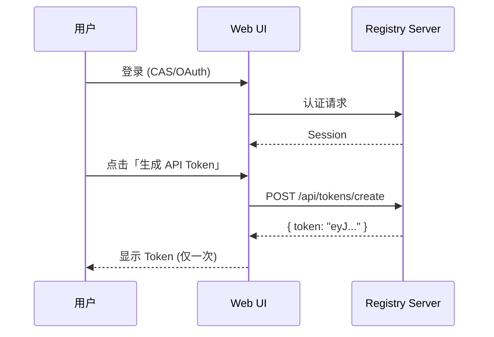
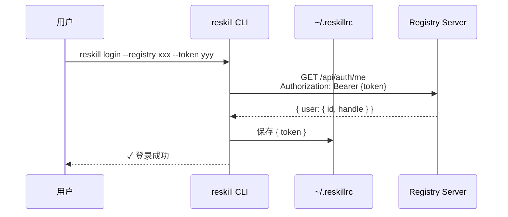
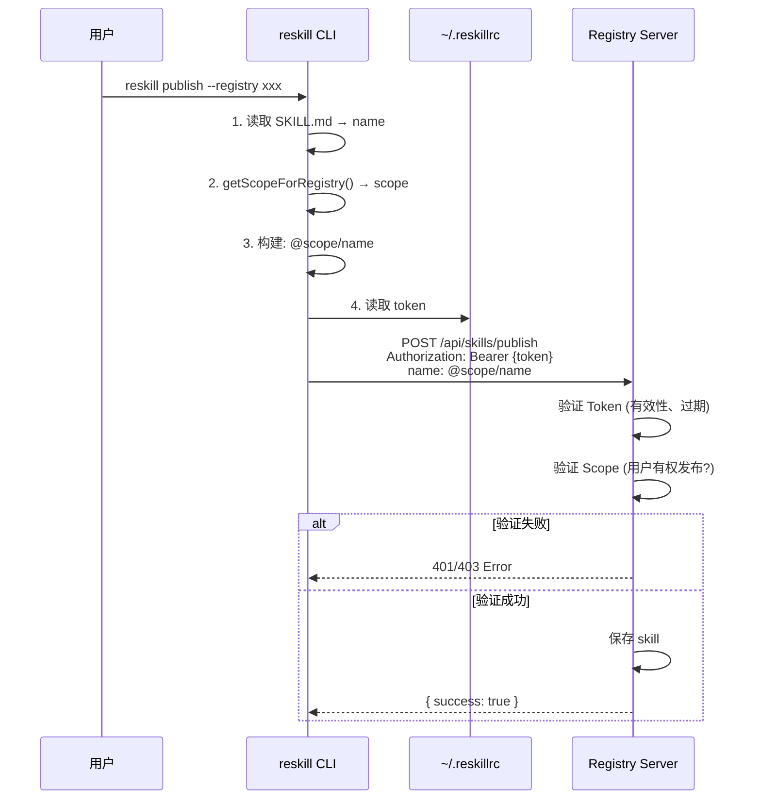
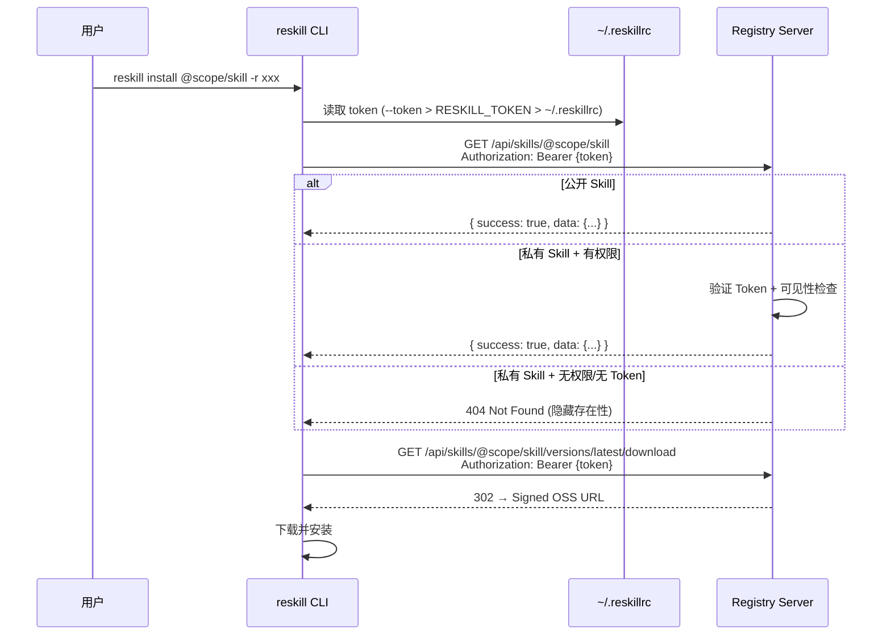

# Token 认证方案设计文档

## 概述

本文档描述 reskill CLI 的 Token 认证方案，包括登录、发布流程以及身份验证机制。

## 背景

- 移除邮箱密码登录，只保留 Token 登录
- Token 由 Web UI 生成，CLI 只负责存储和使用
- Scope 校验由服务端处理，CLI 不做额外校验

## 架构设计

### 系统角色

| 组件 | 职责 |
|-----|------|
| Web UI | 用户认证 (CAS/OAuth)、生成 API Token |
| CLI | 存储 Token、构建 skill name、发送请求 |
| Registry Server | 验证 Token、验证 Scope 权限、保存数据 |

### 数据流

```
┌─────────────┐     ┌─────────────┐     ┌─────────────┐
│   Web UI    │────▶│  ~/.reskillrc │◀───│    CLI      │
│  生成 Token  │     │  存储 Token  │     │  使用 Token │
└─────────────┘     └─────────────┘     └─────────────┘
                                               │
                                               ▼
                                        ┌─────────────┐
                                        │   Server    │
                                        │ 验证 + 校验  │
                                        └─────────────┘
```

## 完整流程

### 阶段一：Web UI 生成 Token



### 阶段二：CLI 登录



### 阶段三：Publish



### 阶段四：Install（私有 Skill）



> Token 是可选的。公开 Skill 不携带 Token 也能安装；私有 Skill 必须先通过 `reskill login` 获取 Token。

## Scope 机制

### CLI 端 Scope 来源

CLI 通过 `REGISTRY_SCOPE_MAP` 映射 registry URL 到 scope：

```typescript
const REGISTRY_SCOPE_MAP: Record<string, string> = {
  'https://rush-test.zhenguanyu.com': '@kanyun',
  'https://rush-test.zhenguanyu.com/': '@kanyun',
  'http://localhost:3000': '@kanyun',
  'http://localhost:3000/': '@kanyun',
};
```

### 服务端 Scope 校验

服务端通过 `REGISTRY_SCOPE` 环境变量配置内网模式：

```typescript
// 内网模式：REGISTRY_SCOPE=kanyun
// 所有认证用户都可以发布到 @kanyun/* scope

function verifyScope(skillName: string, publisherHandle: string): boolean {
  const scope = skillName.match(/^@([^/]+)\//)?.[1]?.toLowerCase();
  
  // 无 scope：允许
  if (!scope) return true;
  
  // 内网模式：所有人可发布到 INTERNAL_SCOPE
  if (INTERNAL_SCOPE && scope === INTERNAL_SCOPE.toLowerCase()) {
    return true;
  }
  
  // 外网模式：只有 handle 匹配才能发布
  return scope === publisherHandle.toLowerCase();
}
```

### 配置对应关系

| CLI 配置 | 服务端配置 | 说明 |
|---------|-----------|------|
| `REGISTRY_SCOPE_MAP['https://xxx']` = `'@kanyun'` | `REGISTRY_SCOPE=kanyun` | 两边需要一致 |

## Token 存储

### 存储位置

`~/.reskillrc` (权限 600)

### 存储格式

```json
{
  "registries": {
    "https://rush-test.zhenguanyu.com/": {
      "token": "eyJhbGciOiJIUzI1NiIs..."
    }
  }
}
```

### 读取优先级

1. 环境变量 `RESKILL_TOKEN`
2. `~/.reskillrc` 中对应 registry 的 token

## API 接口

### GET /api/auth/me

验证 Token 并返回用户信息。

**请求：**
```
GET /api/auth/me
Authorization: Bearer {token}
```

**响应：**
```json
{
  "success": true,
  "user": {
    "id": "wangzirenbj",
    "handle": "kanyun"
  }
}
```

**说明：**
- `id`: 用户名 (JWT sub 字段)
- `handle`: 用户可发布的 scope (INTERNAL_SCOPE 或 userId)

### POST /api/skills/publish

发布 skill。

**请求：**
```
POST /api/skills/publish
Authorization: Bearer {token}
Content-Type: multipart/form-data

name: @kanyun/my-skill
version: 1.0.0
description: ...
tarball: (file)
```

**响应：**
```json
{
  "success": true,
  "data": {
    "name": "@kanyun/my-skill",
    "version": "1.0.0",
    "integrity": "sha256-...",
    "tag": "latest"
  }
}
```

**错误响应：**
- `401 Unauthorized`: Token 无效或过期
- `403 Forbidden`: 无权发布到该 scope
- `409 Conflict`: 版本已存在

## 安全考虑

1. **Token 存储**: `~/.reskillrc` 权限设为 600，仅用户可读写
2. **Token 传输**: 使用 HTTPS，Token 放在 Authorization header
3. **Token 过期**: 服务端验证 JWT 过期时间
4. **Rate Limiting**: 服务端对 /api/auth/me 和 /api/skills/publish 有限流

## CLI 改动清单

| 文件 | 改动 |
|-----|------|
| `src/core/registry-client.ts` | 删除 login()，更新 WhoamiResponse 添加 handle |
| `src/cli/commands/login.ts` | 移除邮箱密码登录，修复存储 user.handle |
| `src/cli/commands/whoami.ts` | 显示 handle 而不是 id |
| `src/cli/commands/publish.ts` | 移除 fallback，强制要求 registry 在映射表 |
| 测试文件 | 删除/更新相关测试 |

## 服务端 (reskill-app)

**不需要改动** - `/api/auth/me` 和 `/api/skills/publish` 已满足需求。
